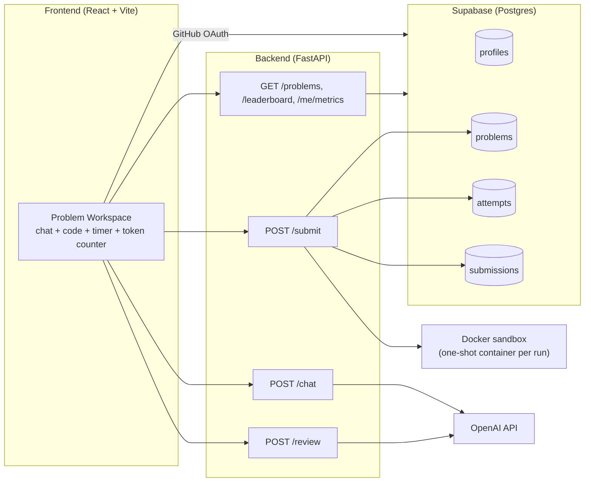
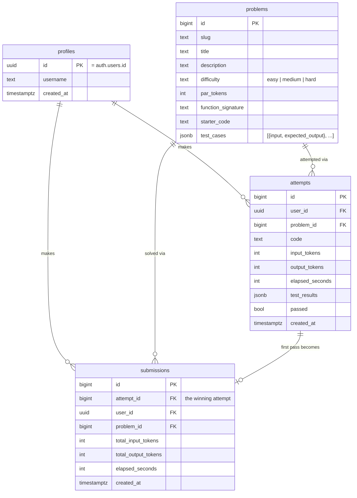
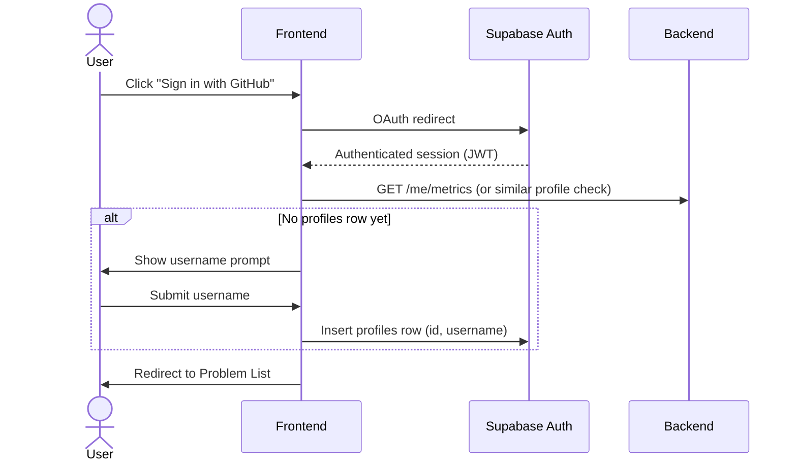
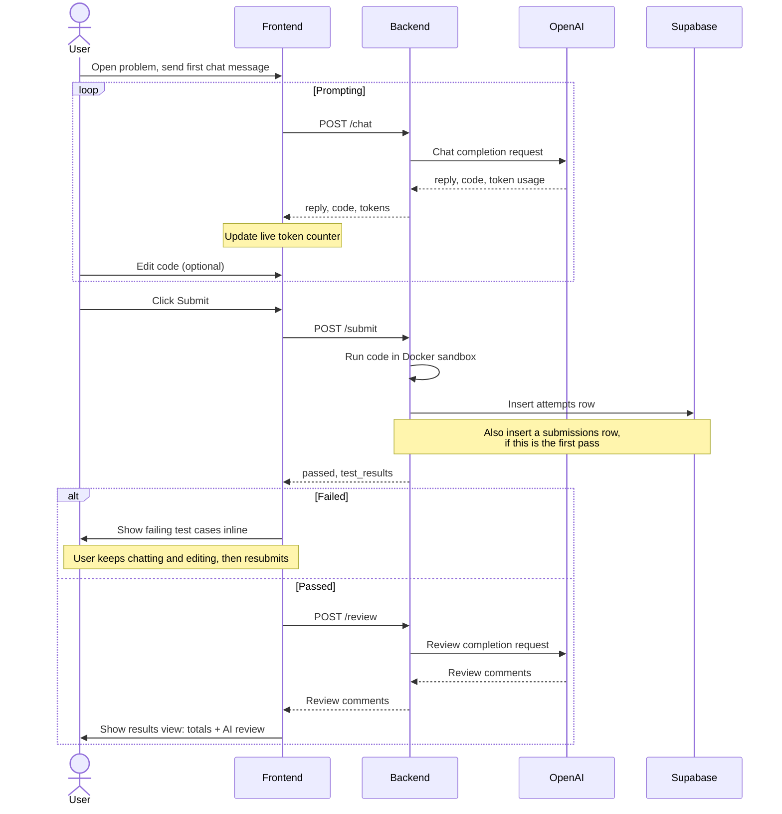
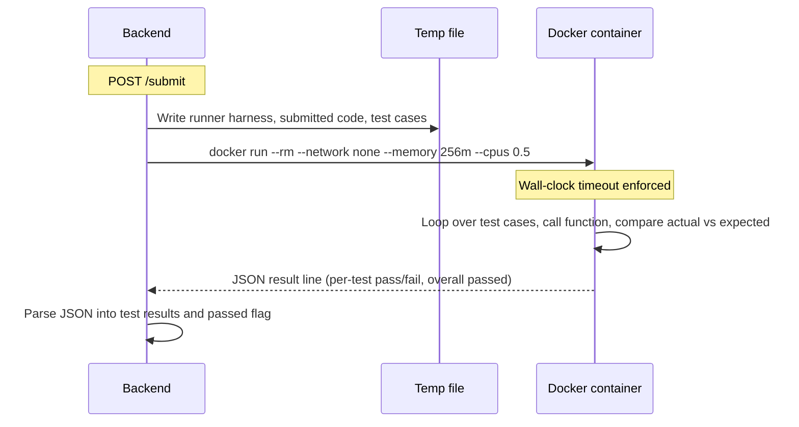

# ParScript (Par Prompt)

A LeetCode-style trainer for **efficient AI-assisted coding**. Instead of writing code by hand,
users solve algorithmic problems by prompting an LLM agent. The core metric is **token
efficiency** — total input + output tokens used, measured against a per-problem "par" target —
with completion time as a tiebreaker. After a passing submission, an AI reviewer comments on how
the code could be improved.

This README summarizes the system design. See [DESIGN.md](DESIGN.md) for the full original spec
and scope notes.

## Contents

- [Tech stack](#tech-stack)
- [Architecture](#architecture)
- [Data model](#data-model)
- [Backend API](#backend-api)
- [Core flows](#core-flows)
  - [Auth + onboarding](#auth--onboarding)
  - [Prompt → submit → pass loop](#prompt--submit--pass-loop)
  - [Submission sandbox execution](#submission-sandbox-execution)
- [Frontend structure](#frontend-structure)

## Tech stack

| Layer          | Choice                                                              |
| -------------- | -------------------------------------------------------------------- |
| Frontend       | React + Vite, client-side routing via `react-router`                |
| Backend        | FastAPI (Python 3.10+, required for `X \| Y` union type syntax)      |
| DB + Auth      | Supabase (Postgres, GitHub OAuth)                                    |
| LLM            | OpenAI API — cheap model for solving, and for the post-pass review   |
| Code execution | Docker — one generic Python sandbox image, one `docker run` per submission |

## Architecture

**Design principles baked into the architecture:**

- Token counts for the live counter are **client-reported and trusted** — no server-side session
  ledger.
- Chat/code session state lives only in React state (plus local storage for convenience); there's
  no server-side resume of an in-progress session after a refresh.
- Only the **first** passing submission per user+problem counts toward the leaderboard/metrics —
  re-solving an already-passed problem does not create a new `submissions` row.
- Test cases are never hidden — all are visible to the user up front.
- The Docker timeout/resource cap exists for **demo stability** (so a runaway LLM solution can't
  hang things), not as security hardening against a malicious user.

## Data model

- `profiles` — one row per user, created on first login right after username onboarding.
- `problems` — seeded by hand (e.g. Two Sum, Valid Parentheses, Reverse Linked List) with test
  cases and manually-authored `par_tokens`.
- `attempts` — **one row inserted per Submit click, pass or fail, never updated.** This is the full
  history of every run.
- `submissions` — inserted once, the first time a user passes a given problem. Leaderboard and
  personal metrics both read from this table exclusively.

## Backend API

| Endpoint                       | Body / Params                                                          | Returns                                                    |
| ------------------------------- | ------------------------------------------------------------------------ | ------------------------------------------------------------ |
| `POST /chat`                    | `{problem_id, message_history}`                                       | `{reply, code, input_tokens, output_tokens}`               |
| `POST /submit`                  | `{problem_id, code, input_tokens, output_tokens, elapsed_seconds}`     | `{passed, test_results, attempt_id}`                       |
| `POST /review`                  | `{problem_id, code}`                                                    | AI review comments (not persisted)                          |
| `GET /problems`                 | optional difficulty filter                                              | Problem list                                                |
| `GET /problems/{id}`            | —                                                                        | Full detail incl. `starter_code`, `test_cases`             |
| `GET /leaderboard/{problem_id}` | —                                                                        | Submissions for the problem, tokens asc, time-tiebreak asc |
| `GET /me/metrics`               | (auth'd user)                                                            | Aggregate stats + history table, scoped to `submissions`   |

## Core flows

### Auth + onboarding

### Prompt → submit → pass loop

### Submission sandbox execution

## Frontend structure

- **Login/onboarding** — Supabase GitHub auth button; username prompt on first login
  (`OnboardingGate`, `UsernamePrompt`).
- **Problem list** — cards/table filtered by difficulty, showing difficulty tag + par tokens
  (`ProblemListPage`, `ProblemCard`, `DifficultyFilter`).
- **Problem workspace** — split view: problem description, chat panel, editable code panel, live
  token counter against par, elapsed timer since first message (`ProblemWorkspacePage`,
  `ChatPanel`, `CodePanel`, `TokenCounter`, `Timer`).
- **Results view** — on pass, shows finalized totals and the AI review comments
  (`ReviewComments`).
- **Leaderboard** — per-problem table, tokens ascending, time tiebreak, username
  (`LeaderboardPage`, `LeaderboardTable`); a global leaderboard variant also exists
  (`GlobalLeaderboardPage`, `GlobalLeaderboardTable`).
- **Personal metrics page** — totals solved, avg tokens-vs-par ratio (overall + by difficulty),
  submission history table (`ProfilePage`, `MetricsHistoryTable`).
